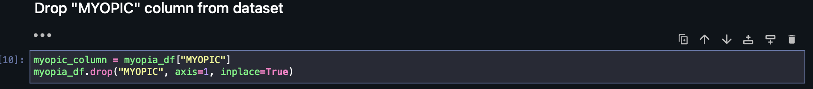
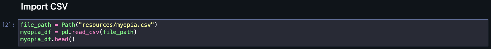
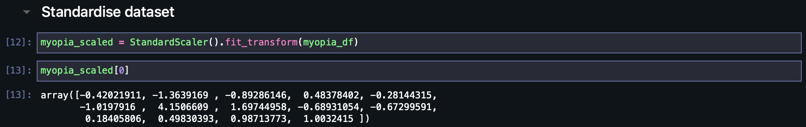
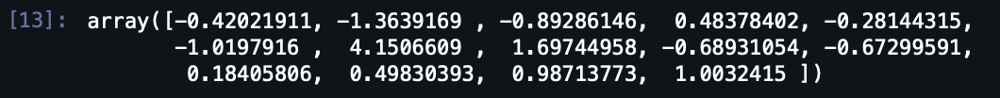
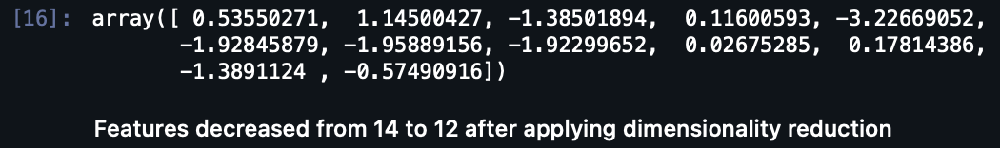
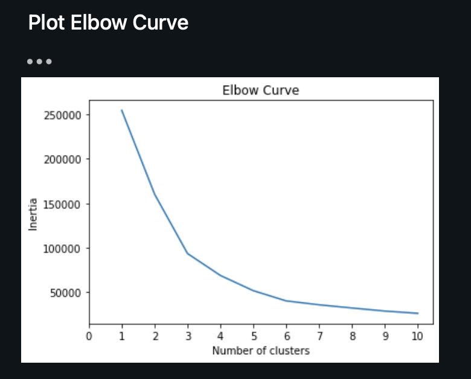

# Unsupervised ML - Myopia Clusters

# Machine Learning Bootcamp Assignment

This assignment applies what I learned about unsupervised learning by fitting data to a model and using clustering algorithms to place data into groups. Finally, visualization were created that shares my findings and analysis. 

## Background

You are on the data science team of a medical research company that’s interested in finding better ways to predict myopia, or nearsightedness. Your team has tried—and failed—to improve their classification model when training on the whole dataset. However, they believe that there might be distinct groups of patients that would be better to analyze separately. So, your supervisor has asked you to explore this possibility by using unsupervised learning.

You have been provided with raw data, so you’ll first need to process it to fit the machine learning models. You will use several clustering algorithms to explore whether the patients can be placed into distinct groups. Then, you’ll create a visualization to share your findings with your team and other key stakeholders.

## Instructions

This activity is broken down into four parts: 

* Part 1: Prepare the Data

* Part 2: Apply Dimensionality Reduction 

* Part 3: Perform a Cluster Analysis with K-means

* Part 4: Make a Recommendation 

### Part 1: Prepare the Data

1. Read `myopia.csv` into a Pandas DataFrame.

2. Remove the "MYOPIC" column from the dataset.

3. Standardize your dataset so that columns that contain larger values do not influence the outcome more than columns with smaller values.

### Part 2: Apply Dimensionality Reduction

1. Perform dimensionality reduction with PCA. How did the number of the features change?

Using `PCA(n_components=0.99)` creates a model that will preserve approximately 99% of the explained variance, whether that means reducing the dataset to 80 principal components.

2. Further reduce the dataset dimensions with t-SNE and visually inspect the results. To do this, run t-SNE on the principal components, which is the output of the PCA transformation. 

3. Create a scatter plot of the t-SNE output. Are there distinct clusters?

### Part 3: Perform a Cluster Analysis with K-means

Create an elbow plot to identify the best number of clusters.

* Use a `for` loop to determine the inertia for each `k` between 1 through 10. 

* If possible, determine where the elbow of the plot is, and at which value of `k` it appears.

### Part 4: Make a Recommendation

Can the patients be clustered? If so, into how many clusters? 
